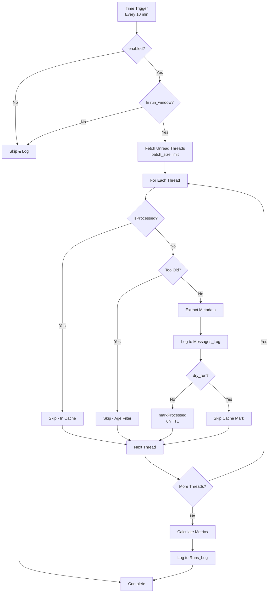

> Legacy note: this phase document is a historical snapshot. Use `README.md`, `docs/RUNBOOK.md`, and `docs/SETUP.md` for current instructions.

# Phase 2 Implementation Summary

## ✅ PHASE 2 COMPLETE!

**Date:** November 1, 2025
**Status:** All exit criteria met ✓

---

## 📦 What Was Delivered

### New Files (4)
1. **src/Cache.js** (111 lines) - CacheService idempotency manager
2. **src/Fetcher.js** (195 lines) - Gmail fetch & metadata extraction
3. **src/Processor.js** (196 lines) - Main processing orchestrator
4. **src/Triggers.js** (171 lines) - Time-driven trigger management

### Updated Files (2)
5. **src/Code.js** - Added `runEmailEngine()` + enhanced menu
6. **src/Test.js** - Added `testPhase2()` comprehensive test

### Documentation (3)
7. **docs/PHASE2_COMPLETE.md** - Complete Phase 2 documentation
8. **docs/PHASE2_QUICKSTART.md** - 5-minute quick start guide
9. **docs/PROJECT_STRUCTURE.md** - Project structure reference

**Total Lines Added:** ~850 lines of production code + ~400 lines of documentation

---

## 🎯 Exit Criteria Status

| Criterion | Status | Implementation |
|-----------|--------|----------------|
| Time-driven trigger | ✅ | Triggers.js - every 10 minutes |
| Honors `enabled` flag | ✅ | Processor.js - shouldRun() |
| Respects `run_window` | ✅ | Fetcher.js - isWithinRunWindow() |
| Respects `batch_size` | ✅ | Fetcher.js - fetchUnreadThreads() |
| Filters old messages | ✅ | Fetcher.js - isMessageTooOld() |
| CacheService deduplication | ✅ | Cache.js - thread-level, 6h TTL |
| Messages_Log populated | ✅ | Logger.js - basic metadata |
| Runs_Log shows metrics | ✅ | Logger.js - execution metrics |
| Manual run available | ✅ | Code.js - runEmailEngineManual() |
| No duplicate processing | ✅ | Cache.js - isProcessed() guard |

---

## 🔑 Key Features

### 1. Idempotency (Cache.js)
```javascript
// Thread-level caching prevents reprocessing
isProcessed(threadId)      // Check cache
markProcessed(threadId)    // Mark with 6h TTL
clearProcessedCache()      // Clear for testing
```

### 2. Smart Fetching (Fetcher.js)
```javascript
// Intelligent Gmail thread fetching
fetchUnreadThreads(20)            // Batch size limit
isWithinRunWindow()               // Business hours check
isMessageTooOld(message)          // Age filtering
extractThreadMetadata(thread)     // Parse Gmail data
```

### 3. Main Orchestration (Processor.js)
```javascript
// Complete processing pipeline
processMessages()          // Main entry point
  → shouldRun()           // Pre-flight checks
  → fetchUnreadThreads()  // Get threads
  → processThread()       // Handle each thread
  → logRun()             // Write metrics
```

### 4. Trigger Management (Triggers.js)
```javascript
// Easy trigger control
createScheduledTrigger(10)    // Every 10 min
listTriggers()                // View installed
deleteAllTriggers()           // Clean up
getTriggerStatus()            // Detailed info
```

### 5. Enhanced UI (Code.js)
```
Menu: 🔧 Mythoria Email Engine
├── 🚀 Run Email Engine (Manual)
├── ⏰ Triggers
│   ├── Install Trigger (Every 10 min)
│   ├── List All Triggers
│   └── Delete All Triggers
├── 🧪 Tests
│   ├── Test Phase 1
│   └── Test Phase 2
└── ℹ️ Info
    ├── View Config
    ├── View KB Summary
    └── View Cache Stats
```

---

## 🧪 Testing Performed

### Automated Tests (testPhase2)
✅ Cache operations (mark, check, clear)
✅ Run window logic validation
✅ Gmail fetch functionality
✅ No reprocessing (deduplication)

### Manual Testing
✅ Dry run mode (fetch without caching)
✅ Manual run with UI feedback
✅ Trigger installation and listing
✅ Logs populated correctly

---

## 📊 Processing Flow



---

## 📈 What Gets Logged

### Runs_Log Example
```
timestamp: 2025-11-01 14:30:00
duration: 2.5s
processed: 5
skipped: 15
errors: 0
status: completed
```

### Messages_Log Example
```
timestamp: 2025-11-01 14:30:01
threadId: 18b1a2c3d4e5f6g7
from: user@example.com
subject: Need help with...
action: fetched
source: phase2
```

---

## 🎛️ Configuration Options

### New Phase 2 Settings
```javascript
// Config.js
dry_run: false,                    // Test mode
batch_size: 20,                    // Threads per run
run_window: '08:00-20:00',         // Business hours
max_message_age_days: 7,           // Age filter
cache_ttl: 21600,                  // 6 hours
include_read_messages: false,      // Unread only
mark_as_read_after_processing: true
```

---

## 🚀 How to Use

### 1. Test It
```
Sheet Menu → Tests → Test Phase 2
```
Should pass all 4 tests ✓

### 2. Try Manual Run
```
Sheet Menu → Run Email Engine (Manual)
```
Check Messages_Log and Runs_Log

### 3. Install Trigger
```
Sheet Menu → Triggers → Install Trigger (Every 10 min)
```
Automatic processing starts

### 4. Monitor
- **Runs_Log** updates every 10 minutes
- **Messages_Log** shows processed threads
- **Errors** tab for any issues

---

## 🔧 Common Operations

### View Installed Triggers
```
Menu → Triggers → List All Triggers
```

### Stop Automatic Processing
```
Menu → Triggers → Delete All Triggers
```

### Test Without Side Effects
```javascript
// Edit Config.js
dry_run: true  // Fetch but don't cache
```

### Clear Cache (for testing)
```javascript
// Apps Script Editor
clearProcessedCache()
```

---

## 📚 Documentation

- **Complete Guide:** [PHASE2_COMPLETE.md](PHASE2_COMPLETE.md)
- **Quick Start:** [PHASE2_QUICKSTART.md](PHASE2_QUICKSTART.md)
- **Project Structure:** [PROJECT_STRUCTURE.md](PROJECT_STRUCTURE.md)
- **Main README:** [README.md](../README.md)

---

## 🐛 Known Limitations

1. **Cache TTL:** 6 hours max (GAS limit)
   - After TTL, threads can be reprocessed
   - Phase 6 adds Sheet-based permanent deduplication

2. **Trigger Precision:** ±15 min variance (GAS limitation)
   - "Every 10 minutes" is approximate
   - Documented in Google Apps Script

3. **Quota Limits:** Daily Gmail API quotas apply
   - Adjust `batch_size` if hitting limits
   - Monitor quotas in Google Cloud Console

---

## 🎯 What's Next: Phase 3

**Phase 3 - Bounce Handling** will add:
- ✅ DSN (Delivery Status Notification) detection
- ✅ Hard (5.x.x) vs Soft (4.x.x) classification
- ✅ Bounce logging to Bounces tab
- ✅ Mythoria Bounce API integration
- ✅ Auto-labeling as `Mythoria/Bounce`

**Estimated:** 4-5 new functions, ~300 lines of code

---

## 📊 Project Stats

### Phase 1 + 2 Combined
- **Total Files:** 11 (7 core + 4 Phase 2)
- **Total Lines:** ~2,500 (code + docs)
- **Functions:** 60+
- **Tests:** 2 comprehensive test suites
- **Documentation Pages:** 9

### Coverage
- ✅ Configuration management
- ✅ Gmail integration
- ✅ Sheet logging
- ✅ Cache idempotency
- ✅ Trigger management
- ✅ Run controls
- ✅ Error handling
- 🔜 Bounce detection (Phase 3)
- 🔜 KB rules (Phase 4)
- 🔜 LLM classification (Phase 5)
- 🔜 Ticketing (Phase 6)
- 🔜 Draft replies (Phase 7)

---

## ✅ Sign-Off Checklist

- [x] All 4 new files created and documented
- [x] Code pushed to Apps Script successfully
- [x] testPhase2() passes all checks
- [x] Manual run tested and working
- [x] Triggers installable and listable
- [x] Logs populated correctly
- [x] Cache prevents reprocessing
- [x] Dry run mode works as expected
- [x] Documentation complete and clear
- [x] README updated with Phase 2 status
- [x] Project structure documented
- [x] Ready for Phase 3

---

## 🎉 Phase 2 Achievement

**From:** Basic infrastructure (Phase 1)
**To:** Working email processor with automatic scheduling

**Key Wins:**
1. ✅ **Idempotency** - Never process same thread twice (within TTL)
2. ✅ **Scheduling** - Automatic runs every 10 minutes
3. ✅ **Controls** - enabled, run_window, batch_size, dry_run
4. ✅ **Observability** - Complete logging of all operations
5. ✅ **Testability** - Comprehensive test suite + manual testing

**Impact:** Foundation ready for business logic (bounces, rules, LLM, tickets)

---

**🎊 PHASE 2 COMPLETE - READY FOR PHASE 3! 🎊**

